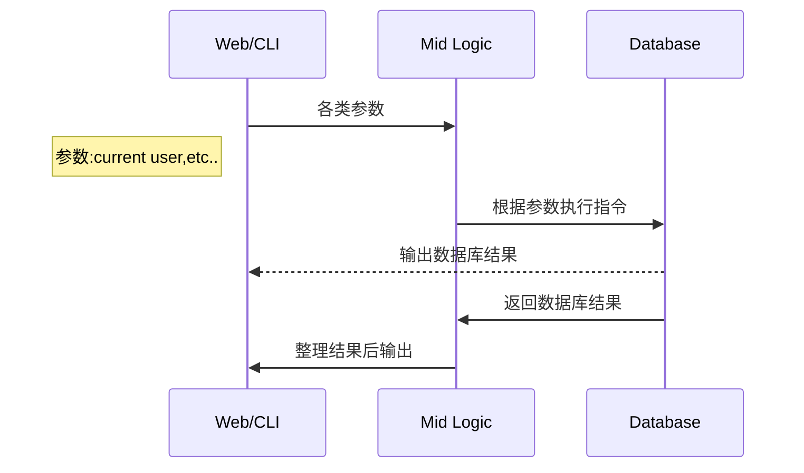
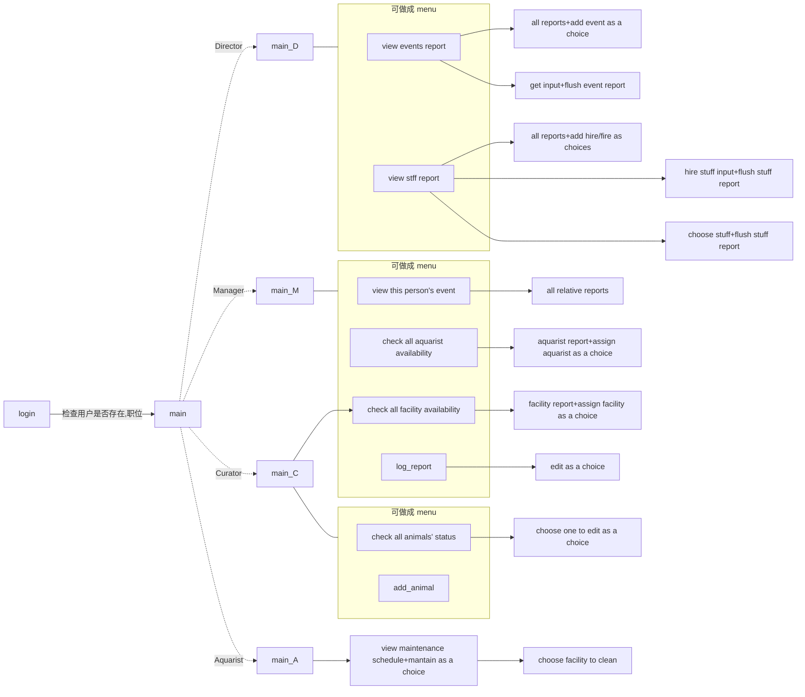
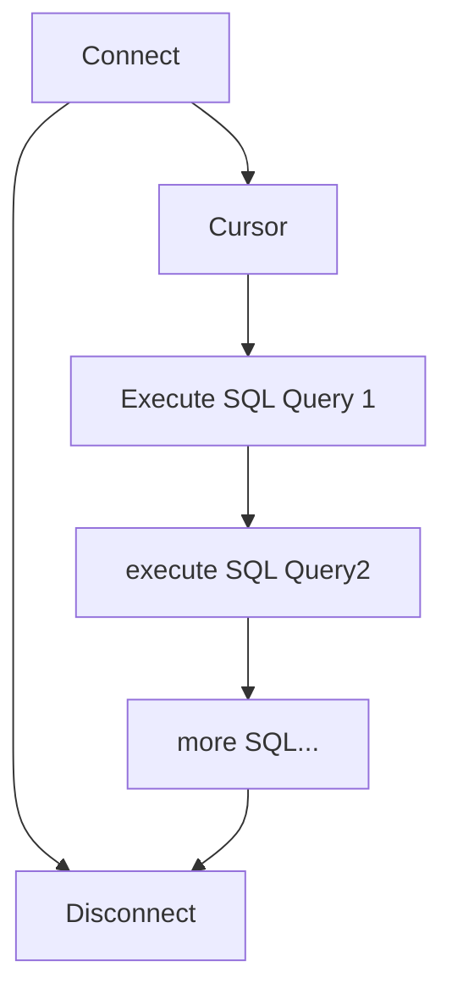

# ~~API Doc~~

# Project Doc


## 总览



## Logic




### 四大操作 增删改查

Director menu

| 增               | 删         | 改   | 查                 |
| ---- | ---- | ---- | ---- |
| Create new event | Fire staff | -    | View events report |
| Hire staff       | -          | -    | view staff report  |

Event Manager menu

| 增   | 删   | 改   | 查   |
| ---- | ---- | ---- | ---- |
|-|-|Assign aquarist to event|View your events|
|-|-|Assign facility to event|check aquarist availability|
|-|-|Log event attendance|check facility availability|

Curator menu function


| 增   | 删   | 改   | 查   |
| ---- | ---- | ---- | ---- |
|Add new animal|-|feed your animals|Check on your animals|
|-|-|-|check facility availability|

Aquarist menu

| 增   | 删   | 改                | 查                        |
| ---- | ---- | ---- | ---- |
| -    | -    | Maintain facility | View maintenance schedule |

----

## 数据库连接

驱动:

[mysqlclien](https://pypi.org/project/mysqlclient/)

Storage Engine:

[InnoDB](https://dev.mysql.com/doc/refman/8.0/en/innodb-storage-engine.html)

**基本流程**:




### pseudo code:

Django Setting:

```python
"""
Database Conf
"""
# settings.py
DATABASES = {
    'default': {
        'ENGINE': 'django.db.backends.mysql',
        'OPTIONS': {
            'read_default_file': '/path/to/my.cnf',
        },
    }
}


# my.cnf
[client]
database = NAME
user = USER
password = PASSWORD
default-character-set = utf8
```

Function Example:

```python
from django.db import connection
"""
连接数据库后
"""
def my_custom_sql(self):
    with connection.cursor() as cursor: 
    # with 关键词将在 该 func 运行完之后自动解除
    # 即 connect-> 执行语句->disconnect
        cursor.execute("UPDATE bar SET foo = 1 WHERE baz = %s", [self.baz])
        cursor.execute("SELECT foo FROM bar WHERE baz = %s", [self.baz])
        row = cursor.fetchone()
        # fetchone 抓取一条执行后的返回值
    return row
  
```

## API

### select

| Function name | input(format)                     | Output(format)              |
| ------------- | --------------------------------- | --------------------------- |
| login_account | Usernamd, password(string,string) | has any suitable value(T/F) |
|               |                                   |                             |
|               |                                   |                             |

- login_account

  根据已有用户名/密码查找是否存在该用户

  明文密码哈希转换后和数据库中比对

  

### insert

| Function name | input(format) | Output(format)       |
| ------------- | ------------- | -------------------- |
| new_event     | ???           | query seceeed? (T/F) |
|               |               | query seceeed? (T/F) |
|               |               | query seceeed? (T/F) |
|               |               | query seceeed? (T/F) |

- new_event

