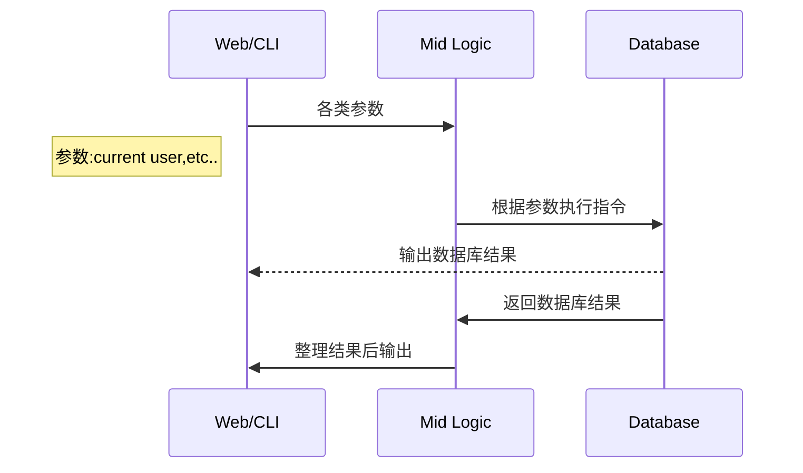
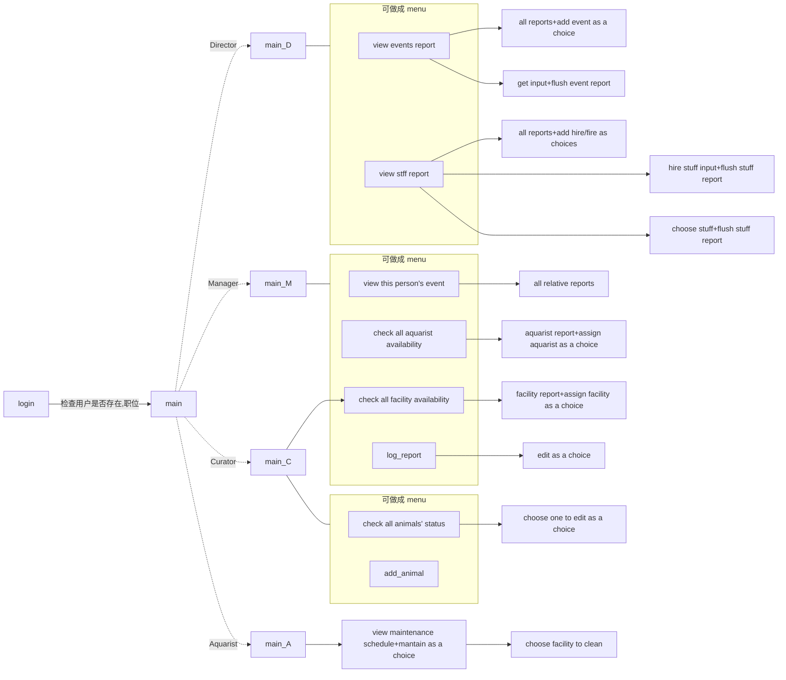
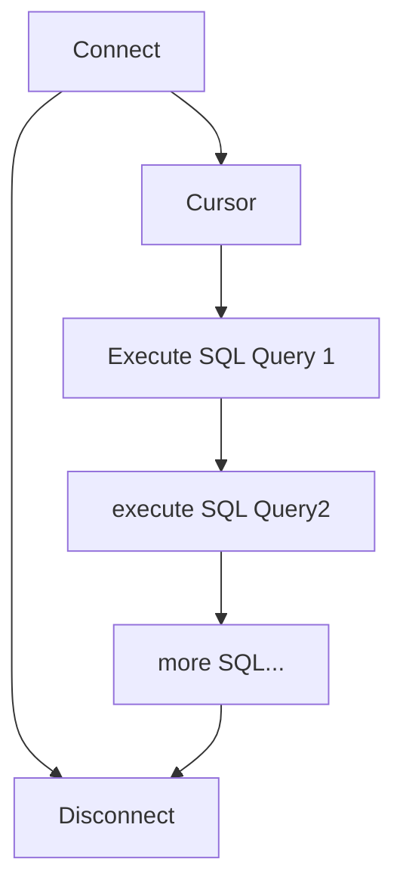
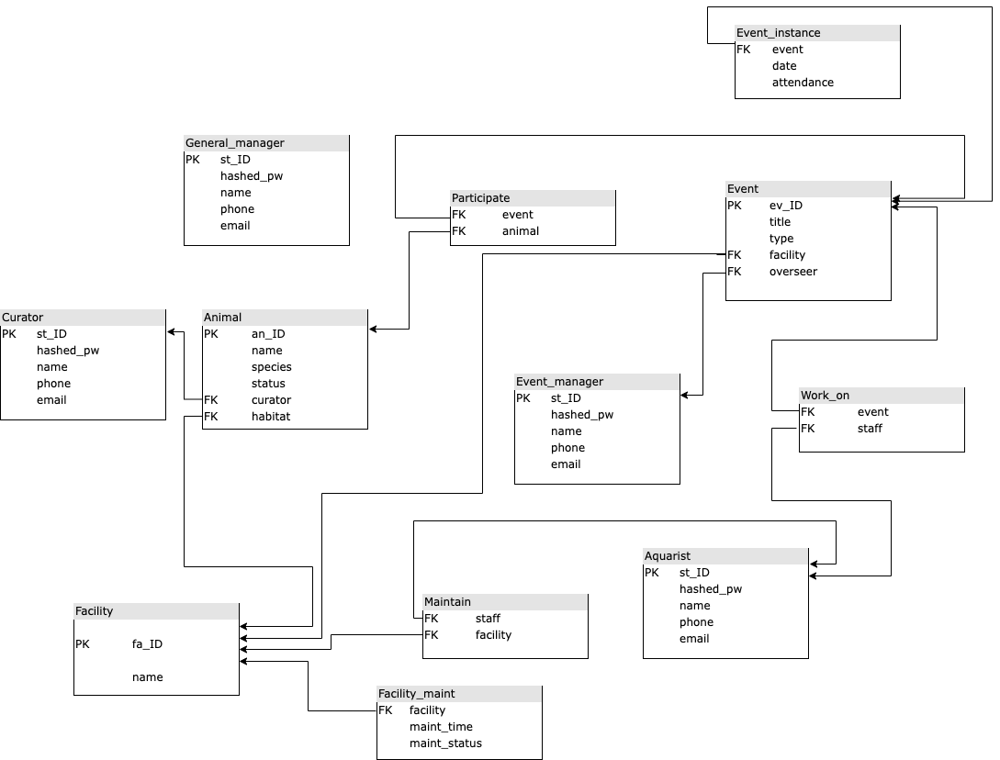

# Aquarium-Management-System

## Configuration

### Database

- User Name
  
  > `root`

- Password
  
  TBA

> ~~`hongkai`~~

- port #

> `3306`

## 运行

已测试

>  基本环境:

>  macOS 12.2.1
>  anaconda3: python 3.8.8

`which python3` 查看当前 python3 编辑器

`pip3 list` 检查依赖包安装情况

需要看到

- Django
- mysqlclient

#### 常见问题:

- `ValueError: Path not found or generated: PosixPath`

> 复制之后路径有问题

> 方法:
>
> 1. [修改virtualenv 相关路径](https://stackoverflow.com/questions/6628476/renaming-a-virtualenv-folder-without-breaking-it)
>
> 2. 本机直接安装所有依赖
>
>    > `cd /path/to/Aquarium_Management_System`
>    >
>    > `pip3 install -r requirements.txt`
>
> 3. python 虚拟机安装依赖
>
>    1. 创建 virtualenv 后进入虚拟机, 执行 step. 2
>
>    2. 使用 pipenv `pipenv install -r /path/to/the/requirements.txt`
>
>       注: python3 自带pipenv, 其已集成了 `virtualenv`,`pip`


- `django.db.utils.OperationalError: (2002, "Can't connect to local MySQL server through socket '/tmp/mysql.sock' (2)")`

> MYSQL daemon 没开

> 方法:
>
> 电脑砸了吧,没用了.


## ~~API Doc~~

### Project Doc

### 总览



### Logic




### web 页面设计


#### 四大操作 增删改查

Director menu

| 增                | 删          | 改   | 查                  |
| ---------------- | ---------- | --- | ------------------ |
| Create new event | Fire staff | -   | View events report |
| Hire staff       | -          | -   | view staff report  |

Event Manager menu

| 增   | 删   | 改                        | 查                           |
| --- | --- | ------------------------ | --------------------------- |
| -   | -   | Assign aquarist to event | View your events            |
| -   | -   | Assign facility to event | check aquarist availability |
| -   | -   | Log event attendance     | check facility availability |

Curator menu

| 增              | 删   | 改                 | 查                           |
| -------------- | --- | ----------------- | --------------------------- |
| Add new animal | -   | feed your animals | Check on your animals       |
| -              | -   | -                 | check facility availability |

Aquarist menu

| 增   | 删   | 改                 | 查                         |
| --- | --- | ----------------- | ------------------------- |
| -   | -   | Maintain facility | View maintenance schedule |

----

### 数据库连接

驱动:

[mysqlclien](https://pypi.org/project/mysqlclient/)

Storage Engine:

[InnoDB](https://dev.mysql.com/doc/refman/8.0/en/innodb-storage-engine.html)

**基本流程**:



**DB Diagrame**




**DB_structure**

```sql

create table aquarist
	(st_ID		char(9),
     hashed_pw	binary(64),
     name		varchar(40),
     phone		char(9),
     email		varchar(40),
     primary key (st_ID)
    );
    
create table curator
	(st_ID		char(9),
     hashed_pw	binary(64),
     name		varchar(40),
     phone		char(9),
     email		varchar(40),
     primary key (st_ID)
    );
    
create table event_manager
	(st_ID		char(9),
     hashed_pw	binary(64),
     name		varchar(40),
     phone		char(9),
     email		varchar(40),
     primary key (st_ID)
    );
    
create table general_manager
	(st_ID		char(9),
     hashed_pw	binary(64),
     name		varchar(40),
     phone		char(9),
     email		varchar(40),
     primary key (st_ID)
    );
    
create table facility
	(fa_ID		char(6),
     name		varchar(40),
     primary key (fa_ID)
     );

create table facility_maint
	(facility	char(6),
     maint_time	time,
     maint_status bool,
     foreign key (facility) references facility(fa_id) on delete cascade
     );
	
create table maintain
	(staff		char(9),
     facility	char(6),
     foreign key (staff) references aquarist(st_ID),
     foreign key (facility) references facility(fa_ID)
	);

create table animal
	(an_ID		char(6),
     name		varchar(40),
     species	varchar(40),
     status		int,
     curator	char(9),
     habitat	char(6),
     primary key (an_ID),
     foreign key (curator) references curator(st_ID) on delete no action,
     foreign key (habitat) references facility(fa_ID) on delete no action
     );
     
create table event
	(ev_ID		char(6),
	 title		varchar(40),
     type		enum('exhibit', 'performance'),
     facility	char(6),
     overseer	char(9),
     primary key (ev_ID),
     foreign key (facility) references facility(fa_ID) on delete no action,
     foreign key (overseer) references event_manager(st_ID) on delete no action
	);

create table event_instance
	(event		char(6),
     date		date,
     attendance	int,
     foreign key (event) references event(ev_ID) on delete cascade
	);
    
create table work_on
	(event		char(6),
     staff		char(9),
     foreign key (event) references event(ev_ID) on delete cascade,
     foreign key (staff) references aquarist(st_ID) on delete cascade
	);
    
create table participate
	(event		char(6),
     animal		char(6),
     foreign key (event) references event(ev_ID) on delete cascade,
     foreign key (animal) references animal(an_ID) on delete cascade
	);

```


#### pseudo code:

Django Setting:

```python
"""
Database Conf
"""
# settings.py
DATABASES = {
    'default': {
        'ENGINE': 'django.db.backends.mysql',
        'OPTIONS': {
            'read_default_file': '/path/to/my.cnf',
        },
    }
}


# my.cnf
[client]
database = NAME
user = USER
password = PASSWORD
default-character-set = utf8
```

Function Example:

```python
from django.db import connection
"""
连接数据库后
"""
def my_custom_sql(self):
    with connection.cursor() as cursor: 
    # with 关键词将在 该 func 运行完之后自动解除
    # 即 connect-> 执行语句->disconnect
        cursor.execute("UPDATE bar SET foo = 1 WHERE baz = %s", [self.baz])
        cursor.execute("SELECT foo FROM bar WHERE baz = %s", [self.baz])
        row = cursor.fetchone()
        # fetchone 抓取一条执行后的返回值
    return row
```


所有语句都放在

GUI/web_gui/sql_query

all_query 别动

### API

**DB connection**

```python
"""
统一 mysq db connection
"""
from all_query.query import 

```


#### select

| Function name | input(format)                     | Output(format)              |
| ------------- | --------------------------------- | --------------------------- |
| login_account | Usernamd, password(string,string) | column name list with resultset |
|               |                                   |                             |
|               |                                   |                             |

return format 

```python
return ['Facility', 'ID', 'Maintenance Time'], result
```

#### insert

| Function name | input(format) | Output(format)           |
| ------------- | ------------- | ------------------------ |
| new_event     | ???           | cursor.rowcount>0? (T/F) |
|               |               |                          |
|               |               |                          |
|               |               |                          |

return example

```python
return True if cursor.rowcount > 0 else False
```


## 目前问题

### 已经使用的 func
director.view_staff_report
aquarist.check_maint_times

